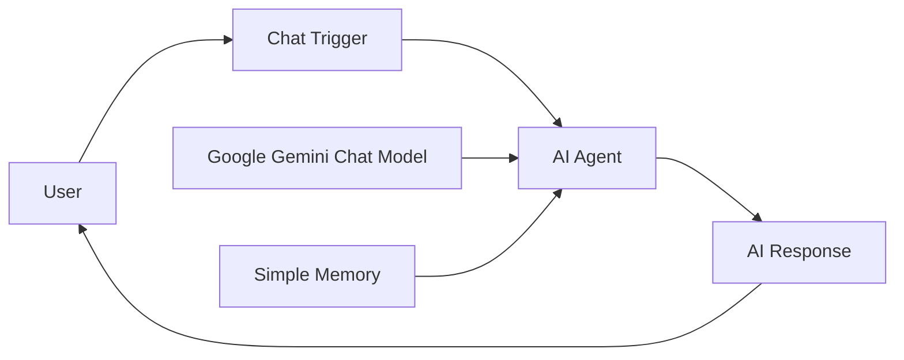

# 5_AI_ChatBot
AI Chatbot Smart Application with n8n & Google Gemini

Build a powerful AI chatbot using n8n, Google Gemini API, and Simple Memory without writing code. This project demonstrates how to create, test, and publish a conversational AI application that can be shared publicly.

Features
No-code AI chatbot development
Google Gemini integration
AI Agent workflow automation
Conversation memory support
Public chat interface
Easy deployment using n8n
Scalable and customizable architecture
Architecture

## Workflow Architecture


Before starting, make sure you have:

An n8n account
A Google account
A Gemini API key from Google AI Studio
Step 1: Create a Gemini API Key
Open Google AI Studio.
Sign in with your Google account.
Navigate to API Keys.
Click Create API Key.
Copy the generated API key.
Step 2: Create a New Workflow in n8n
Log in to n8n.
Click Create Workflow.
Give your workflow a name.
Step 3: Add Chat Trigger
Click Add Node.
Search for Chat Trigger.
Select When Chat Message Received.

This node receives incoming messages from users.

Step 4: Add AI Agent
Click the + button after the Chat Trigger.
Search for AI Agent.
Add the AI Agent node.

The AI Agent will process user requests and generate responses.

Step 5: Configure Google Gemini Chat Model
Inside the AI Agent node, click Chat Model.
Select Google Gemini Chat Model.
Create a new credential.
Paste your Gemini API key.
Save the credential.
Select your preferred Gemini model.
Step 6: Add Memory
Inside the AI Agent node, locate the Memory section.
Click Add Memory.
Select Simple Memory.

This enables conversation history and contextual responses.

Step 7: Test the Chatbot
Save the workflow.
Open the chat panel.
Send a test message.

Example:

Hello

Expected response:

Hi there! How can I help you today?
Step 8: Make the Chat Public
Open the Chat Trigger settings.
Enable Public Chat.
Copy the generated public URL.
Step 9: Publish the Workflow
Click Activate.
Save the workflow.
Share the public chat URL.

Your AI chatbot is now live.

Example Use Cases
Customer Support
FAQ Assistant
Internal Knowledge Base
Educational Assistant
Content Creation Assistant
Product Recommendation Bot
Business Automation
Tech Stack
n8n
Google Gemini API
AI Agent
Simple Memory
Public Chat Interface

## Workflow Architecture

```text
┌───────┐
│ User  │
└───┬───┘
    │
    ▼
┌──────────────┐
│ Chat Trigger │
└──────┬───────┘
       │
       ▼
┌──────────────┐
│   AI Agent   │
└───┬────┬─────┘
    │    │
    │    └──────────────┐
    │                   │
    ▼                   ▼
┌──────────────┐  ┌──────────────┐
│ Google Gemini│  │ Simple Memory│
│ Chat Model   │  │              │
└──────┬───────┘  └──────┬───────┘
       └─────────┬───────┘
                 │
                 ▼
         ┌─────────────┐
         │ AI Response │
         └──────┬──────┘
                │
                ▼
              User
```

Future Enhancements
Vector Database Integration
RAG (Retrieval-Augmented Generation)
Document Upload Support
Multi-Agent Architecture
WhatsApp Integration
Telegram Integration
Slack Integration
Custom Knowledge Base
Author

Built using n8n and Google Gemini to demonstrate no-code AI chatbot development and workflow automation.


Workshop on ai chatbot smart application 
N8n.io website login 
And next click on built a work flow 
add chat add ai agent 
add chat model google gemini chat model use gemini api keys for developrs 
create api key click on gemini chat 
and paste api 
add memory simple memory 
click chat make chat public available publish
